#   **Articles**

##  **Introduction**

On the Website, under the topic homepage, this is the section as **"Most Helpful Articles"**. Articles are the blogs written about the topics, which provide awareness and answers about the good to know facts for any topic. These articles can be read in a small duration even on the go. Also, references are provided to the sources of facts and information.

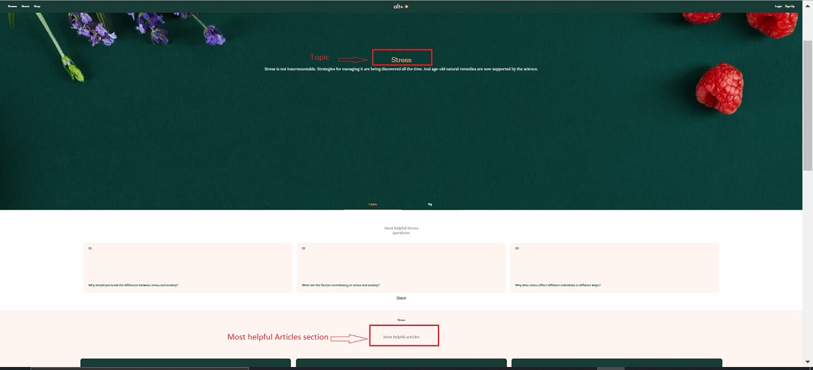

##  **Create an Article**

Let's see a step-by-step process of creating a new article on the website:

1.  Go to -> altpluscare.com/wp-admin
2.  Login with the credentials
3.  Click on **Article** -> **Add New**

    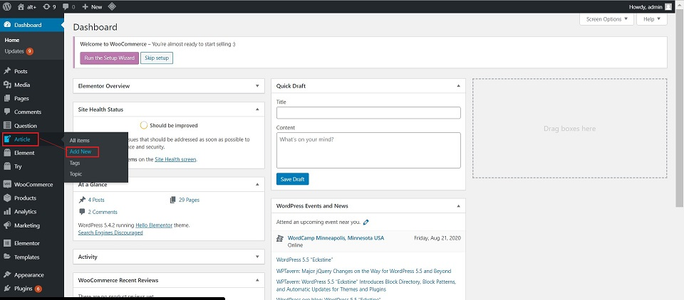

4.  **Add title** : Add the Article name here.

    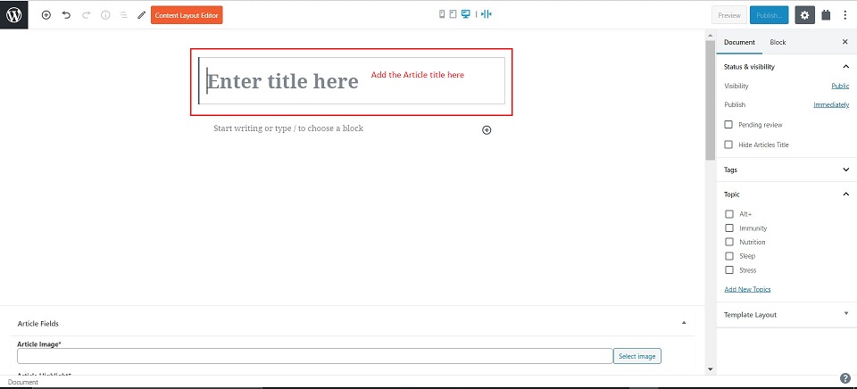

5.  **Add content** by choosing the block as per requirement

    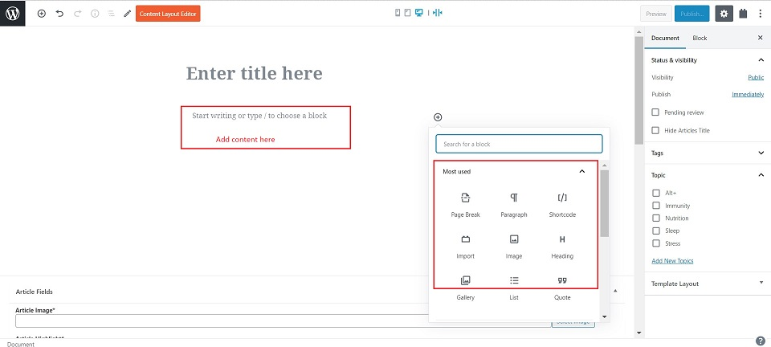

### **Article Fields**

In this section, the below fields are to be populated:

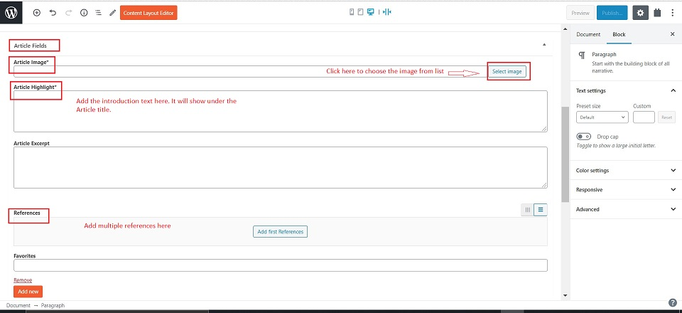

1.  **Article Image** : This is the image that shows on the Article placard on the Topic homepage. Click on "Select image" to choose the image from the list.
2.  **Article Highlight** : This is the text which is written below the Article title. This is how the article title and highlight look on the website.

    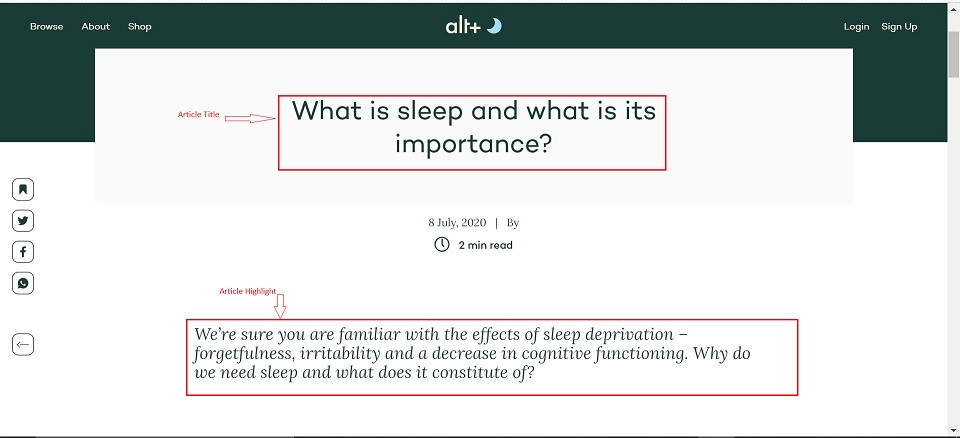

3.  **References** : Here the reference links are added which correspond to the footnote numbers in the content. These footnotes/references take you to the source pages. To add these references, follow the below steps:

    -   Click on "Add first References"

        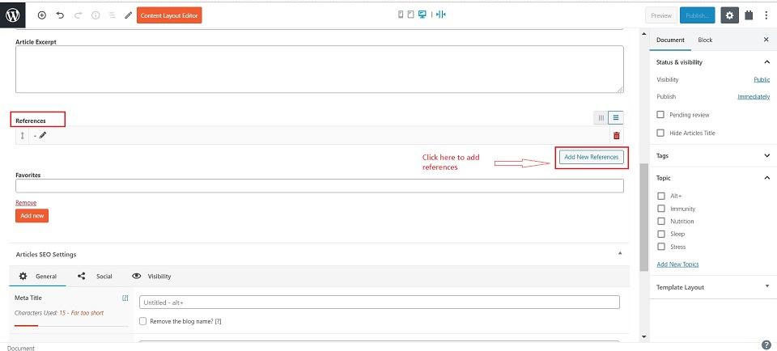

    -   Add **"Reference number"** - This number corresponds to the footnote number in the content part.
    -   Add "**Reference name**"
    -   In **"Reference Link"** add the URL for the source website.

        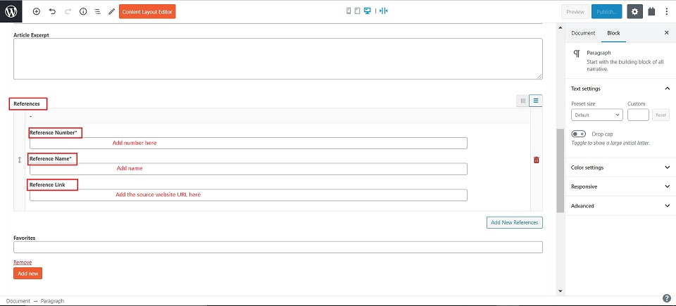

    This is how the references show at the end of the article on the website:

    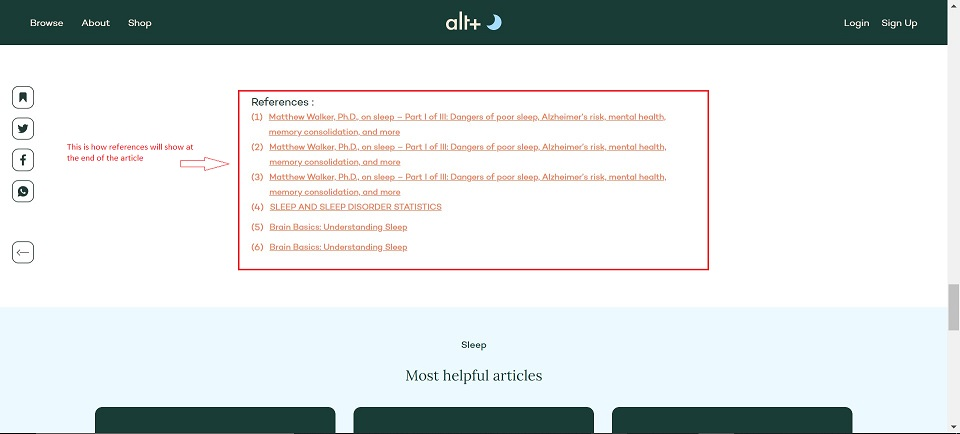

### **Question Article Relationship**

This is the section at the bottom of the page. **Do not make any Changes to this section.**

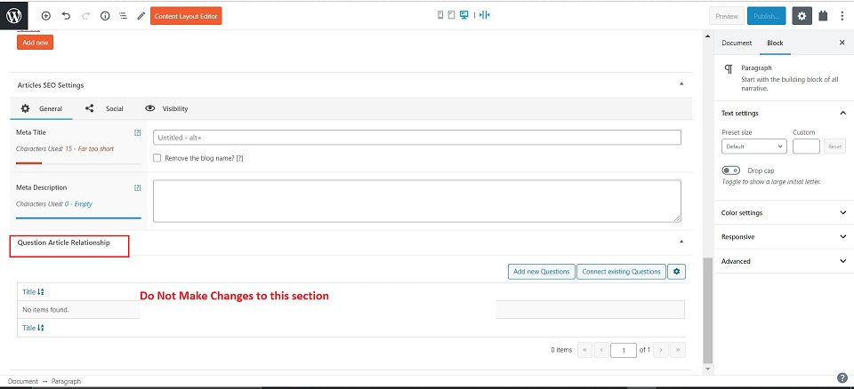

##  **Right Side Panel**

On the right side panel, under the Document tab, populate the following fields:

1.  **Topic** : Check mark the topic name with which you want to connect the question to.

    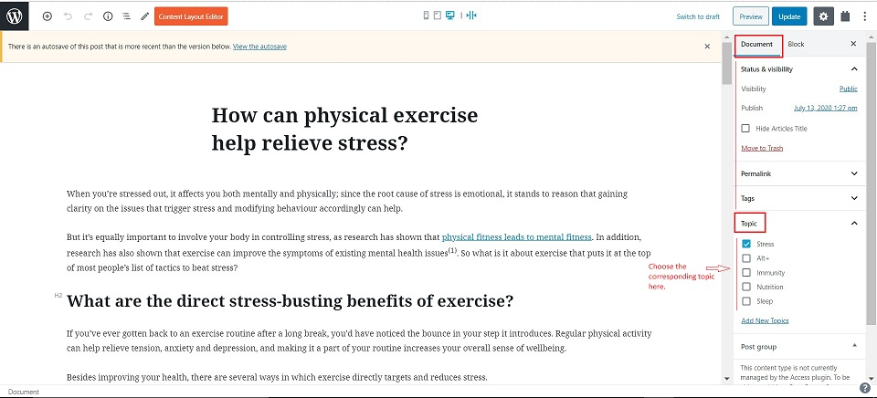

**Note**: Avoid selecting multiple topics here.
    

##  **Publish**

Click on the Publish button on the top right side corner. This will save the new article added.

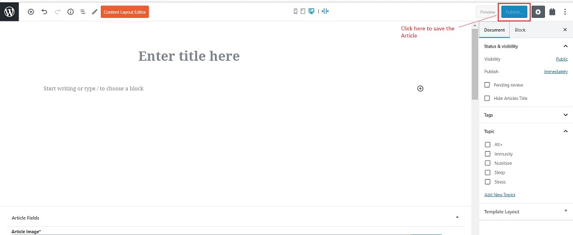

