#   **Elements**

##  **Introduction**

Elements are the organic products/ ingredients which which provide natural solutions to the problems related to topics. Elements is the section on the Topic Homepage which provides the description and related information about the natural ingredients which are the part of the product.

Clicking on each element will take you to a seperate page which provides all information about that ingredient. 

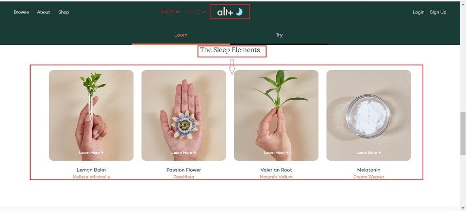

##  **Create an Element**

Below is the step-by-step process of creating these pages:

1.  Go to -> altpluscare.com/wp-admin
2.  Login with the credentials
3.  Click on Element-> Add New
4.  Add the Name/title of the Element here

    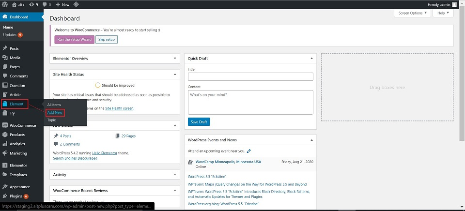

### **Element Fields**

In this section, the fields define the look and layout of the elements card on the page. Below the fields need to filled:

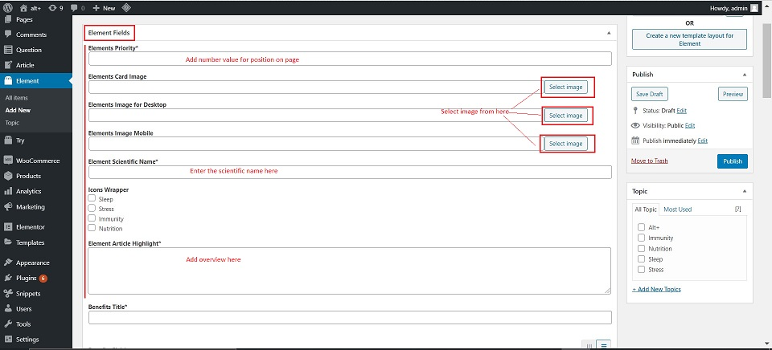

1.  **Elements Priority** : This defines the placement of the element card on the Topic homepage. Priority is always entered as number value.
2.  **Elements Card Image** : This is the image of the element card.

    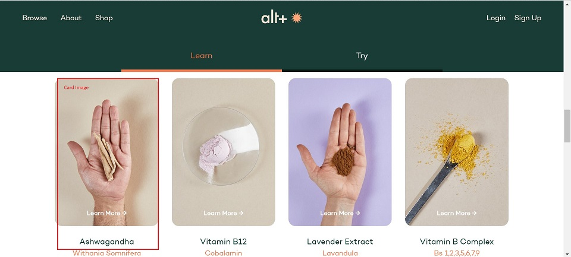

3.  **Elements Image for Desktop** : This is the background image for the element which is visible to desktop users.

    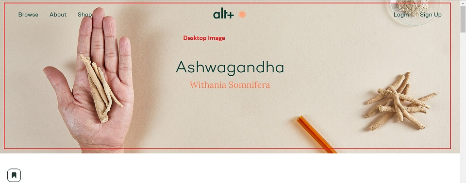

4.  **Elements Image Mobile** : This is the background image for the element which is visible to mobile users.
5.  **Element Scientific Name** : This is the scientific name of the natural ingredient. This name shows below the Element name.

    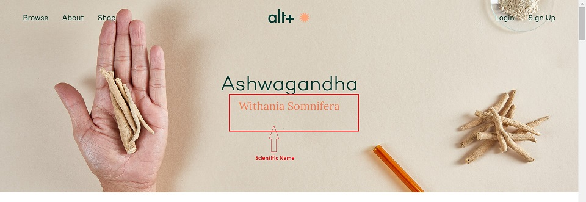

6.  **Element Article Highlight** : This text provides the overview of the element.

    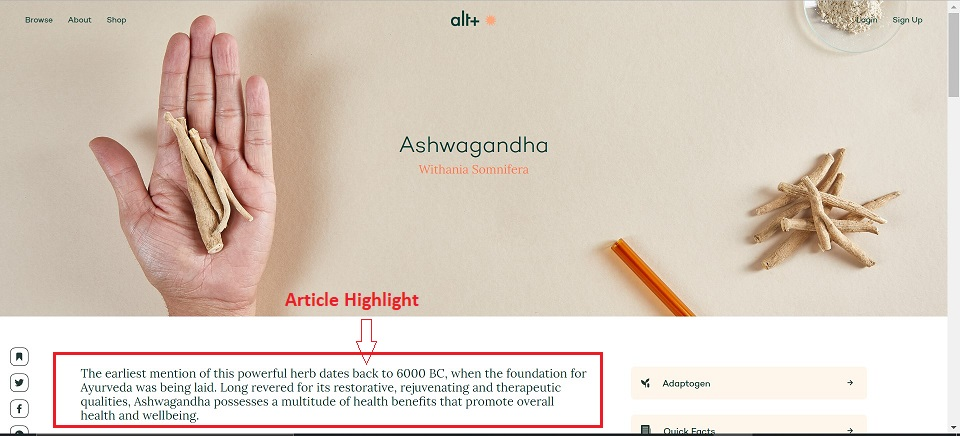

### **Benefits**

This section provides details of various benefits of the element. The following fields need to be filled:

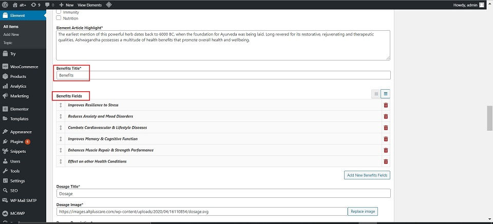

**Benefits title** : Here the title entered is "Benefits".

####  **Benefits fields** : Under this section multiple benefits can be added. For doing this the below fields for each benefit needs to be filled:

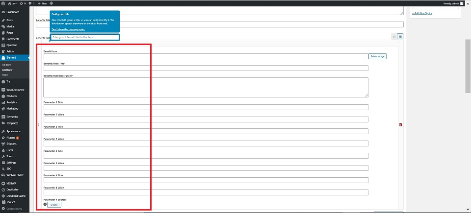

1.  **Benefits Icon** : The image which precedes the Benefit name. This is the same icon which is assigned to a particular topic.
2.  **Benefits Field Title** : This is the name of the benefit.
3.  **Benefits Field Description** : This is the description about the benefit.
4.  **Parameters** : Under this field, 4 parameters are covered. For each Parameter, title and value is entered. 

    -   Parameter 1 : Title is "Scale of Influence". The value entered is on the scale of 100.
    -   Parameter 2 : Title is "Consistency of Study Results". The value entered is on the scale of 100.
    -   Parameter 3 : this can be left blank.
    -   Parameter 4 : Title is "Number of Studies". The value is the number of source reference links attached to the benefit. To add these reference links, follow the below steps:

        -  Add "Source Title" - Name of the link
        -  Add "Source Link" - insert the web URL

        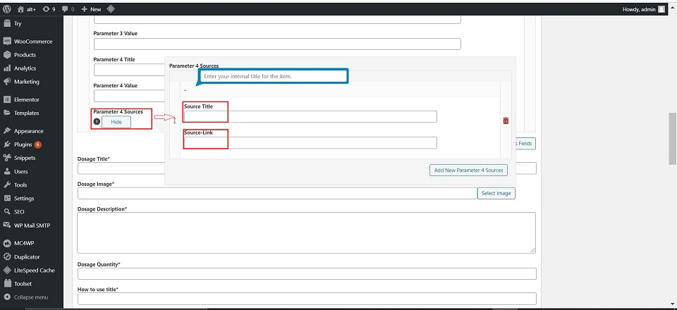

This is how the fields appear on the elements page:

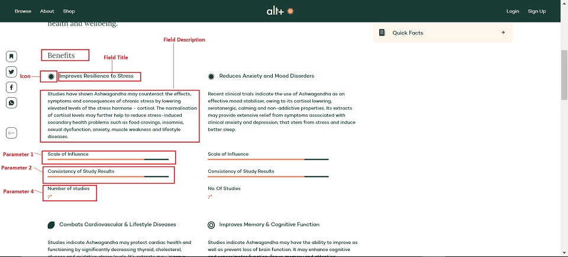

### **Dosage Tile** 

This section explains the dosage quantity to be taken. The below fields need to be filled:

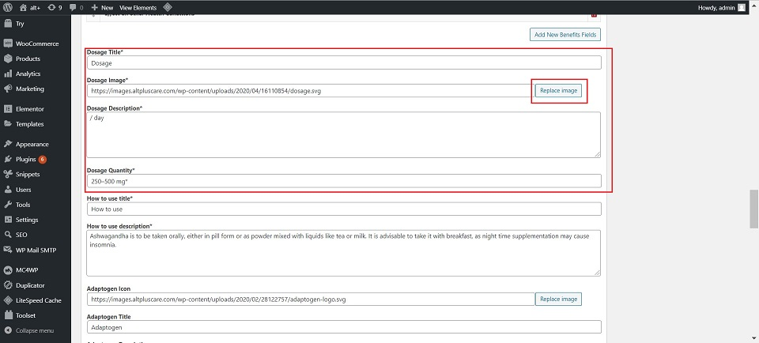

1.  **Dosage Title** : This is the name of the tile that shows on the element page. Enter "Dosage" here.
2.  **Dosage Image** : This is a pre-defined image which needs to be selected from the list.
3.  **Dosage Description** : This should be entered as "/day".
4.  **Dosage Quantity** : Enter the prescribed value.

    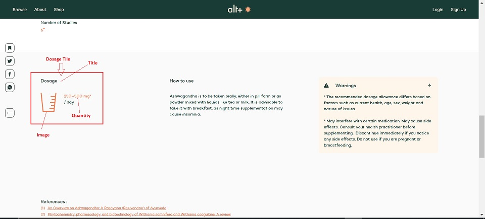

### **How to Use Tile**

This section gives an overview of how to use the element. The following fields need to be filled:

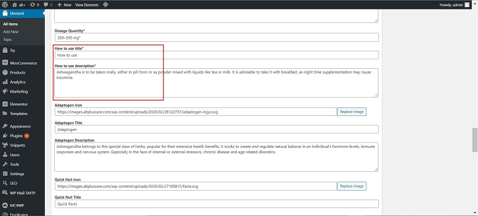

1.  **How to Use Title** : This is the name of the tile on the elements page. Enter "How to Use" here.
2.  **How to use Description** : Enter the prescribed instruction of use here.

    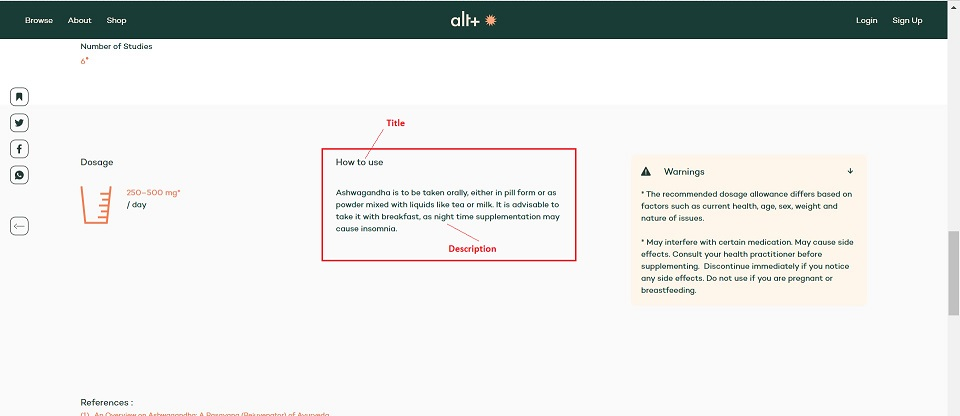

### **Adaptogen Tile**

This is the tile on the right side of the element page. This describes the most important feature of the element. The following fields need to be filled:

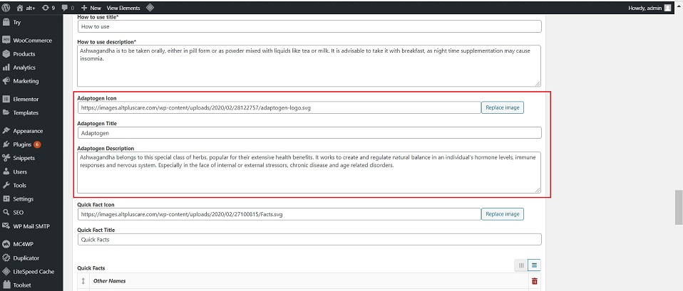

1.  **Adaptogen Icon** : This is a predefined image which precedes the title. Select from the available list.
2.  **Adaptogen Title** : Here enter "Adaptogen".
3.  **Adaptogen Description** : Here enter the basic description text here.

    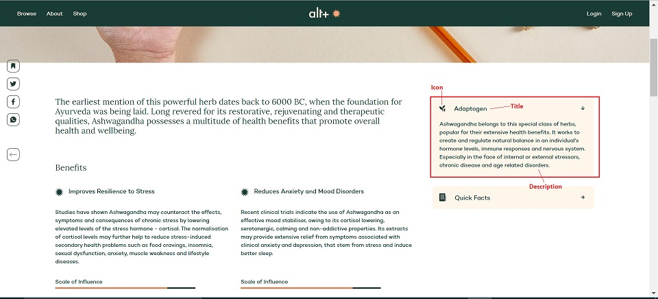

### **Quick Facts**

This tile provides some quick to know facts and is placed below the Adaptogen tile on the right side of the page. 
The below fields need to be filled:

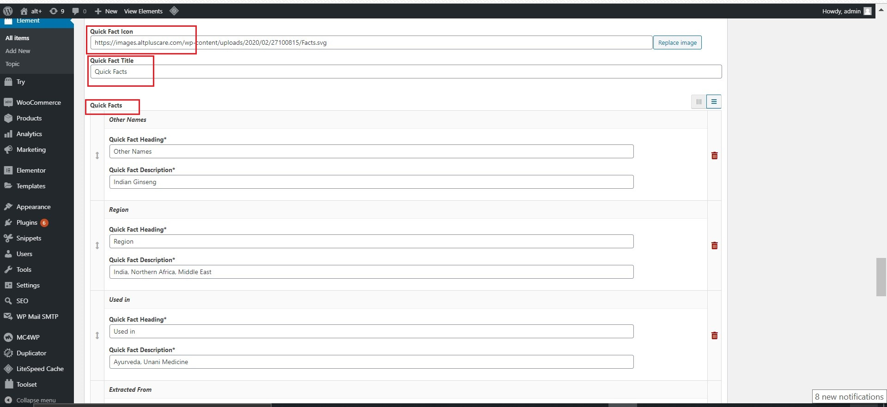

1.  **Quick Fact Icon** : This is a pre-defined image preceding the title.
2.  **Quick Fact Title** : Enter "Quick Facts" as title.
3.  **Quick Facts** : The facts to be included needs to have two fields to be filled - **Quick Fact Heading** and **Quick Fact Description**

    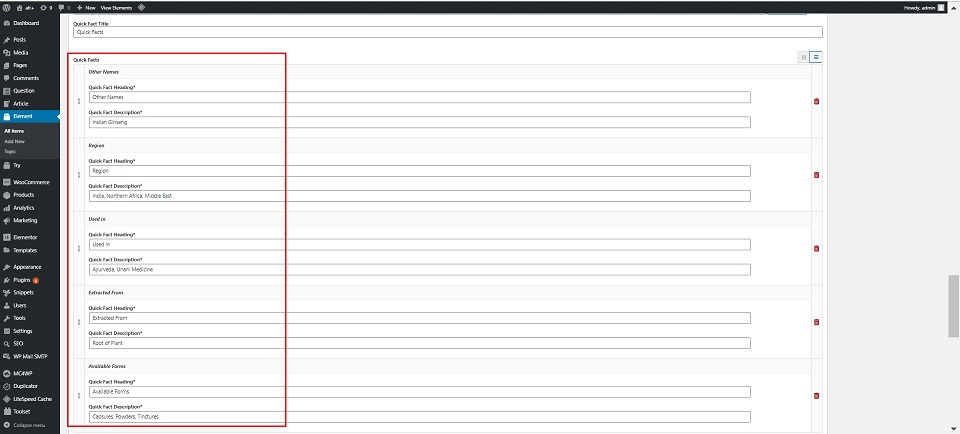

    1.  **Other Names** : Heading - Other Names; Description - add content
    2.  **Region** : Heading - Region; Description - add relevant content
    3.  **Used In** : Heading - Used In; Description - relevant content
    4.  **Extracted From** : Heading - Extracted From; Description - relevant description
    5.  **Available Forms** : Heading - Available Forms; Description - relevant content

This is how the tile looks on the web page:

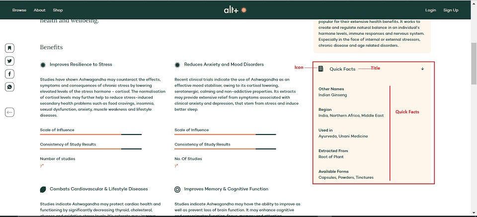

### **Warnings Tile**

This section gives warnings related to the element dosage, usage, who should avoid etc. This tile is placed at the bottom of the page. The below fields need to be filled:

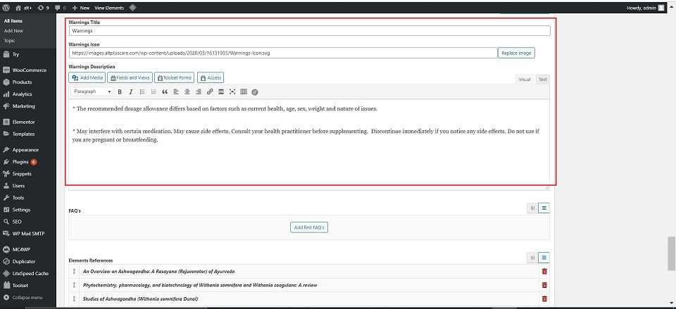

1.  **Warnings Title** : Enter "Warnings* here.
2.  **Warnings Icon** : This is pre-defined image which precedes the title. Select the image from the list.
3.  **Warnings Description** : Add the warnings here. You can use bullet points to add multiple warnings.

This is the final output on the web page:

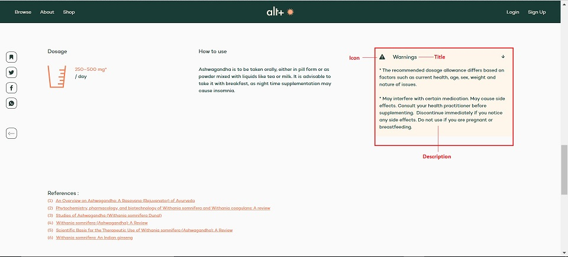

### **Elements Reference**

This is the last section of the elements page where links to web pages/articles are listed. These links provide more facts and information related to the element.
Multiple references can be added in this section. For each reference add the below fields:

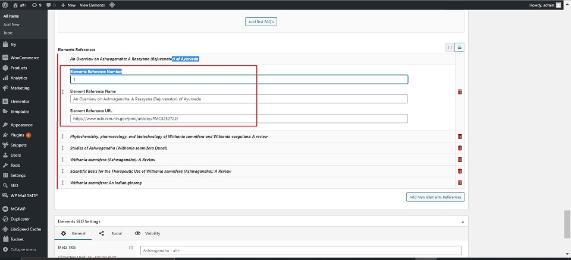

1.  **Elements Reference Number** : this defines the placement of the reference link.
2.  **Element Reference Name** : Add a relevant name to the article /reference link.
3.  **Element Reference Link** : Add the URL to the article.

This is how the section looks on the web page:

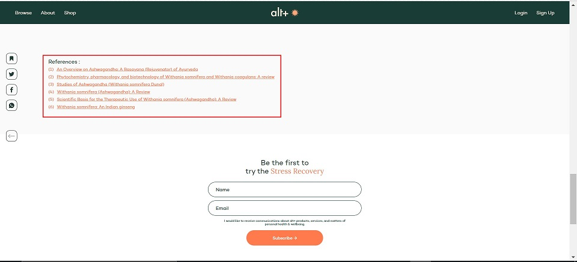

### **Questions Elements**

NO changes are to be done to this section.

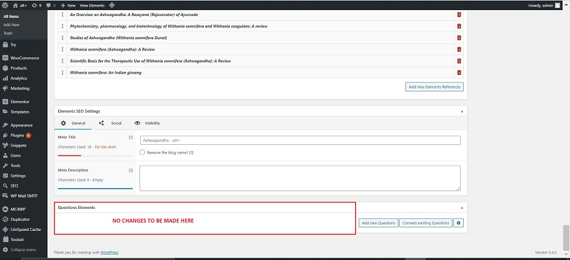

##  **Right Side Panel**

On the right side panel, under the Document tab, populate the following fields:

1.  Topic : Check mark the topic name with which you want to connect the question to.

    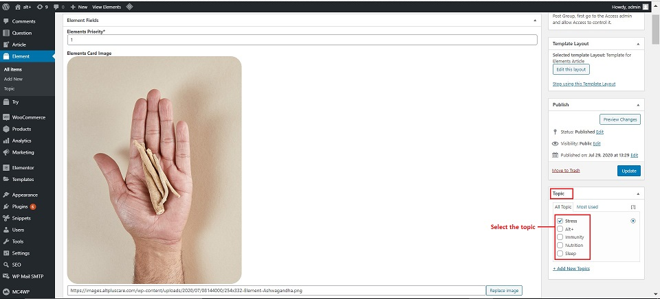

##  **Publish**

Click on the Publish button on the right side panel. This will save the new article added.

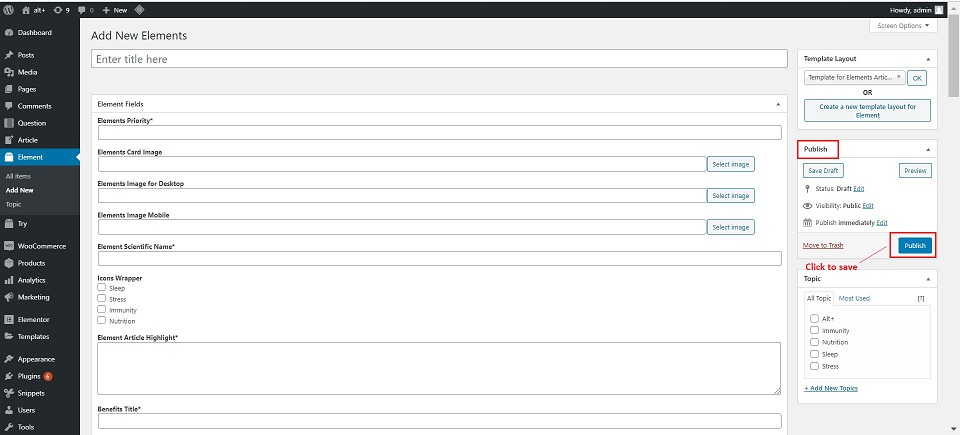
