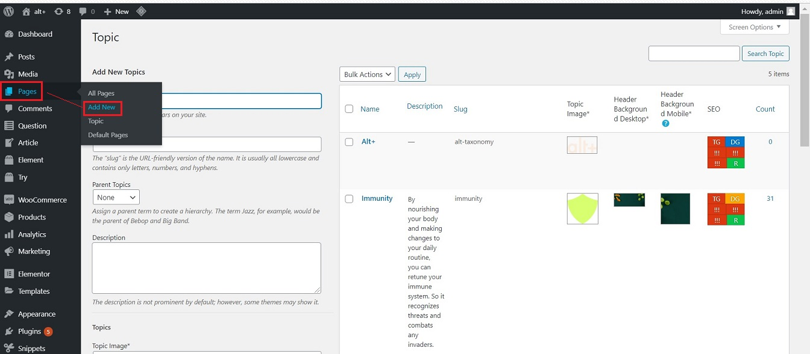

#   **Learn Page**

The learn page for each topic provides the following related information:

-   Basic questions are answered.
-   Helpful articles.
-   Description of Elements helpful in the related concerns.

## **Create Learn Page**

Once a topic is created, it has two parts: Learn Page and the Try Page.

Below are the steps to To add a new Learn Page to the Topic:

1.  Go to -> altpluscare.com/wp-admin
2.  Login with the credentials
3.  Go to -> **Pages** -> **Add New**

    

4.  **Add Title** : this is same as the Topic name.

    

5.  In code editor -> **Select Shortcode** : enter the slug name as "[learn slug = slug name]". This creates the page layout automatically.

    

## **Right Side Panel**

On the right side panel, under the Document tab, populate the following fields:

1.  **Permalink** -> URL Slug : Enter the slug name

    

2.  **Topic** : Check mark the topic name

    

##  **Publish**

Click on the Publish button on the top right side corner. This will save the new page added.

  