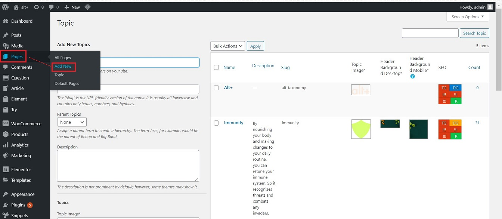
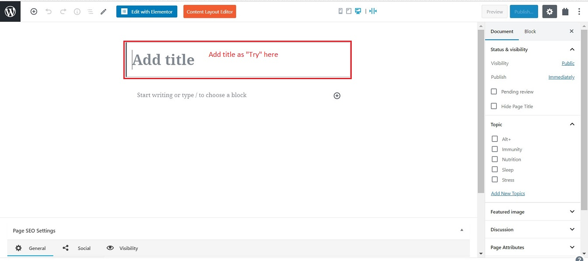
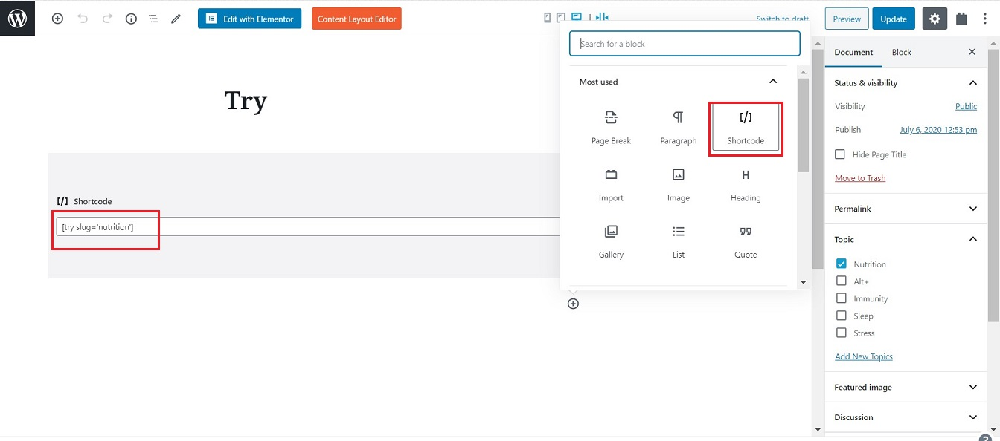
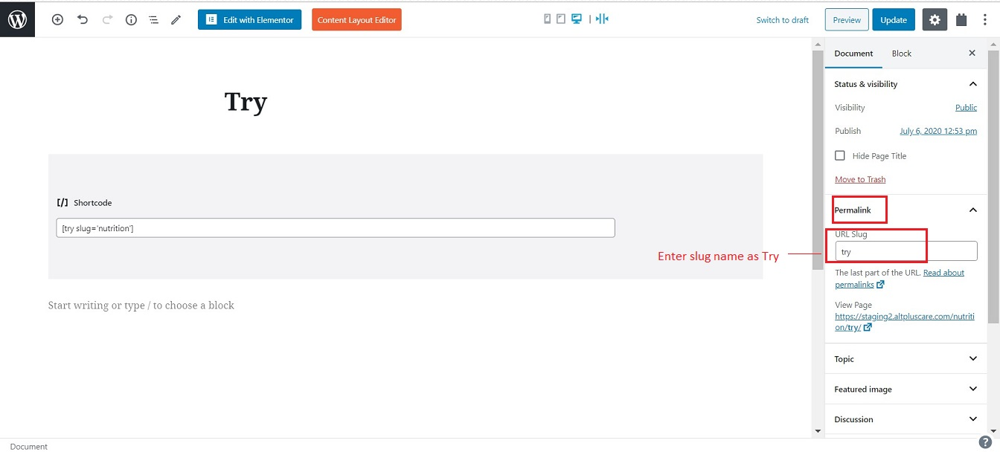
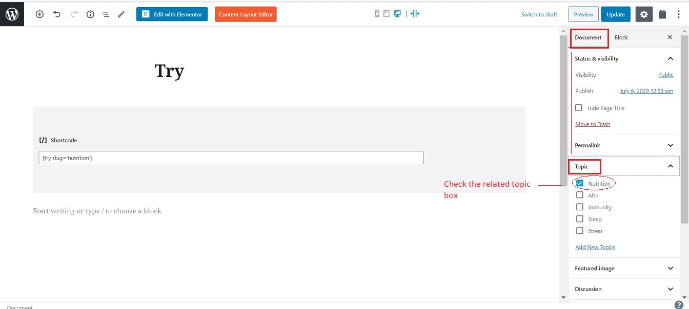
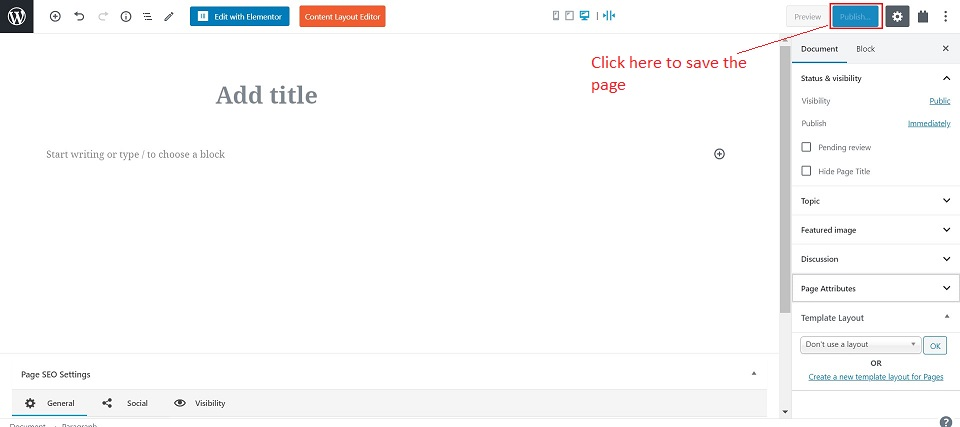
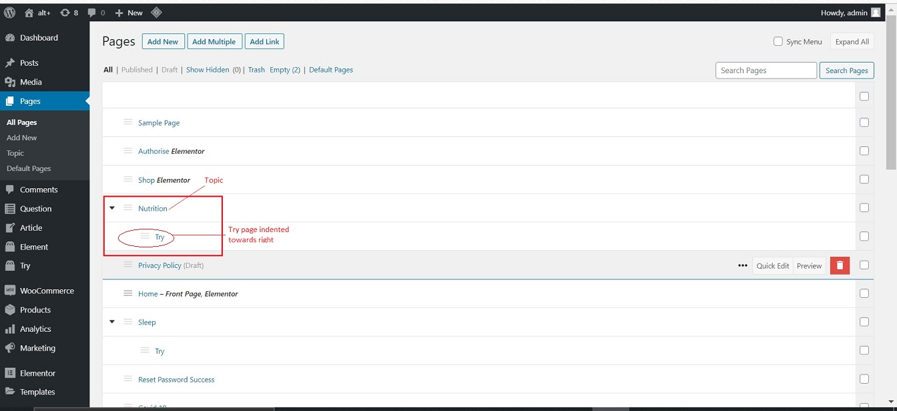

#   **Try Page**

The Try page of a Topic provides information about:

-   The product available related to the topic.
-   Option to buy the product

##  **Create Try Page**

Below are the steps to create a Try page for the topic:

1.  Go to -> altpluscare.com/wp-admin
2.  Login with the credentials
3.  Go to -> Pages -> Add New

    

4.  Add Title : Enter Try as the title

    

5.  In code editor -> Select Shortcode : enter the slug name as "[try slug = slug name]". This creates the page layout automatically.

    

## **Right Side Panel**

On the right side panel, under the Document tab, populate the following fields:

1.  Permalink -> URL Slug : Enter the slug name

    

2.  Topic : Check mark the topic name

    

##  **Publish**

Click on the Publish button on the top right side corner. This will save the new page added.

##  **Placement of Try Page**

Once the Try page is added, it will show under the Topic name. You will need to indent it one step towards the right.

