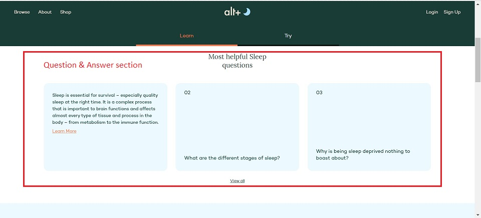
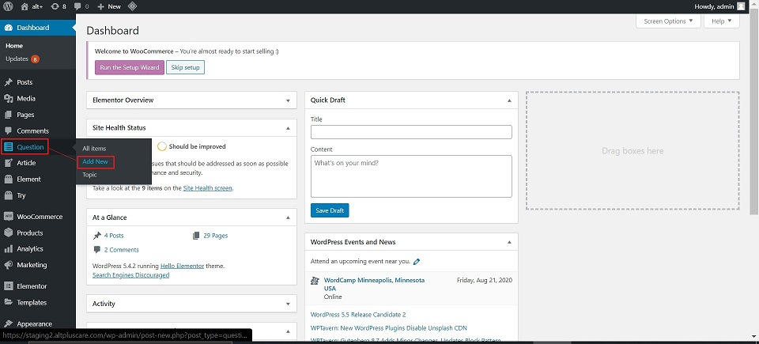
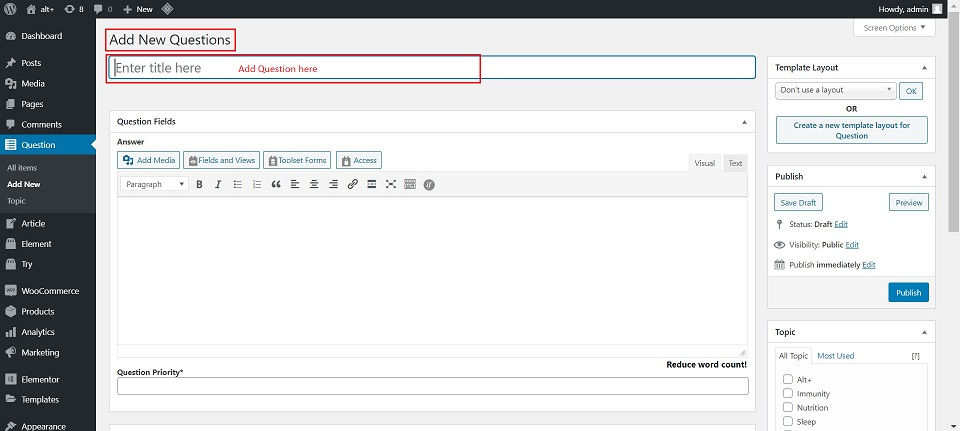
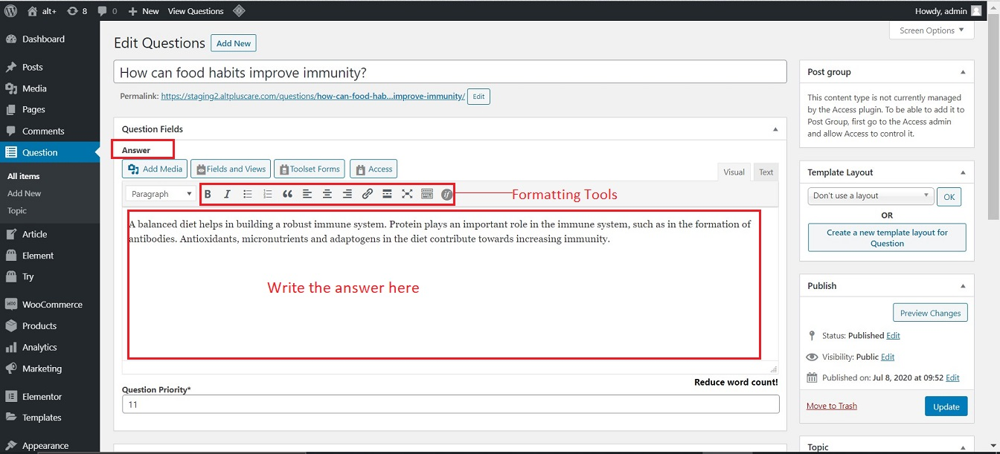
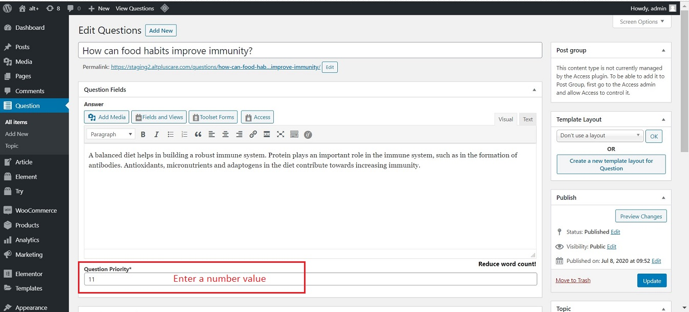
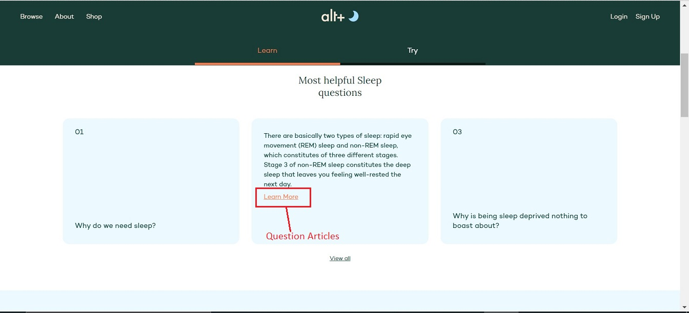
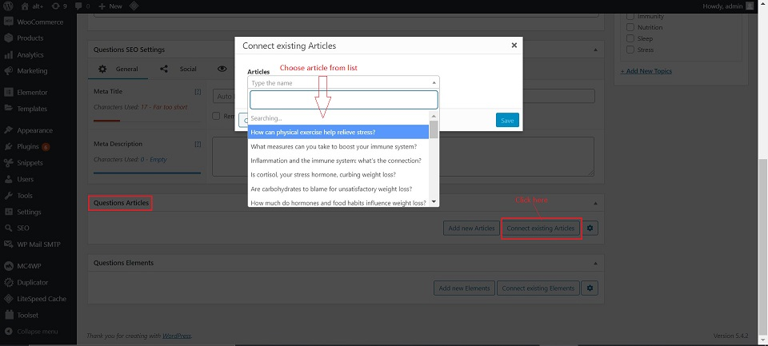
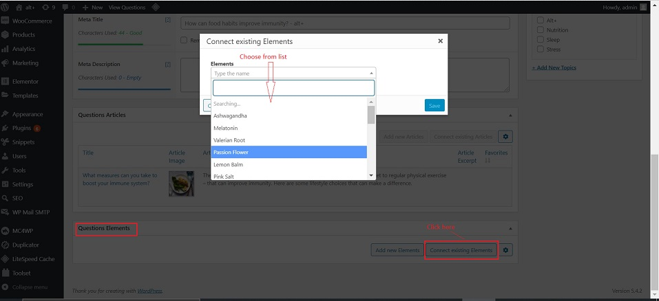
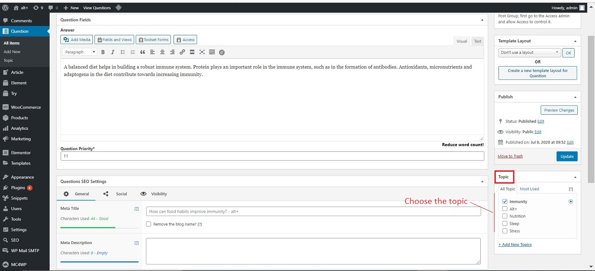
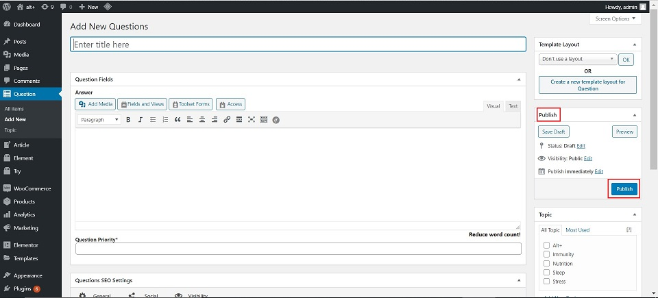

#   **Questions**

##  **Introduction**

The learn page of each topic has a very interactive Question and Answer section which provides awareness about:

-   Common questions related to the topic are answered.
-   References to articles are provided for more clarity and confirmation of facts.

This is how the Question/Answer section looks on the website:

##  **Add Question**

Below we will see the steps to add/update/edit the Question/Answer section as per requirement:

1.  Go to -> altpluscare.com/wp-admin
2.  Login with the credentials
3.  Click -> Question -> Add New

    

4.  Add Title field : Add the Question here

    

### **Question Fields**

This is the part of the page where the below fields are updated:

1.  **Answer** : Add the answer here. All formatting tools are available to format text.

    

2.  **Question priority** : This defines the placement of the Question placard on the website. Only numbers can be entered here. When a new question with a required priority is added, the priority for all questions needs to be altered.

    Solution for this is - add priority in the differentials of 20 each. This gives enough scope for adding questions before or after the existing questions.

    

### **Question Articles**

Articles are the links that are attached to the "Learn More" part of the answer. These are simple articles which provide more facts and information about the Question.

1.  Go to -> Question Articles tab
2.  Click on "Connect existing Articles"
3.  Choose the most relevant pre-uploaded article to attach to the Question.

### **Question Elements**

Question Elements are the nutrients/ingredients associated with the topic.

1.  Go to -> Question Elements tab
2.  Click on "Connect existing Elements"
3.  Choose the most relevant pre-uploaded element to attach to the Question. 

    **Things to keep in mind**

    -   Only one connection out of Articles and Elements can be active at a time.
    -   Deactivate the previous connection to make the new connection.
    -   NEVER click on "thrash" - it will delete the connection permanently from everywhere.

##  **Right Side Panel**

On the right side panel, under the Document tab, populate the following fields:

1.  Topic : Check mark the topic name with which you want to connect the question to.

    

##  **Publish**

Click on the Publish button on the right side panel. This will save the new question added.

