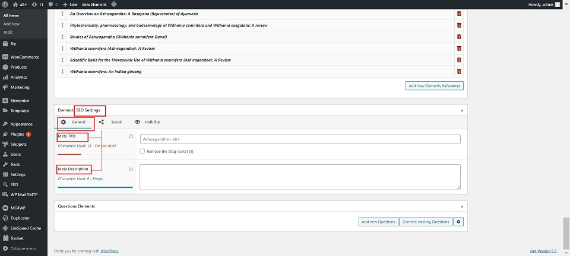
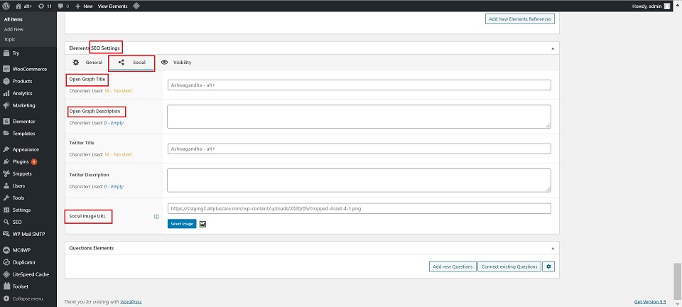

#   **SEO Management**

We can edit/update SEO Management settings for all the sections of the website.

Below are the steps to be followed to make the changes:

##  **SEO Settings**

### **General**

Under the General tab, the below fields need to be updated with the content provided:

1.  Meta Title : Here the name is entered.
2.  Meta Description : Enter the content provided to you.

### **Social**

The following fields under the social tab are required to be filled with the content provided:

1.  Open Graph Tile
2.  Open Graph Description
3.  Social Image URL

