#   **Topic**

##  **Introduction**

Topics are the menu options that are visible on the website Homepage.

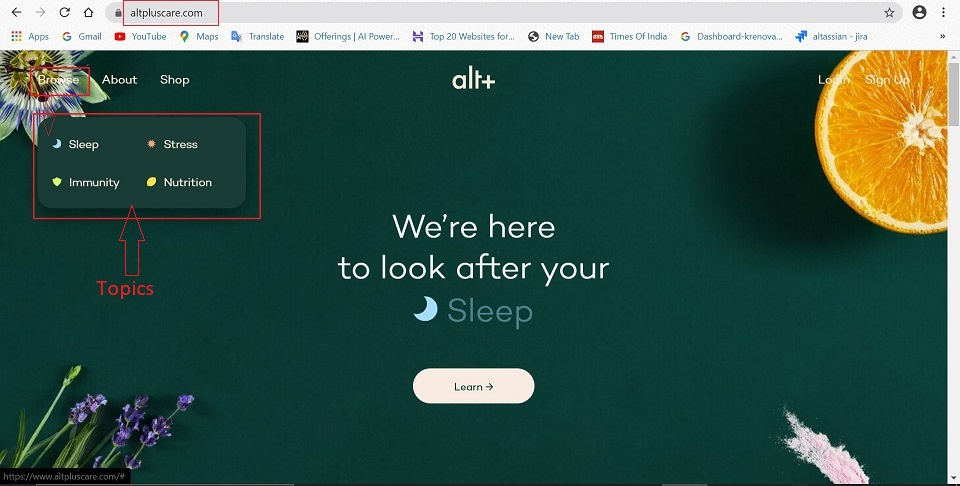

## **Create Topic**

Below is the step-by-step guide to create Topics:

1.  Go to -> altpluscare.com/wp-admin
2.  Login with the credentials
3.  Click on **Pages** on the left side panel.

    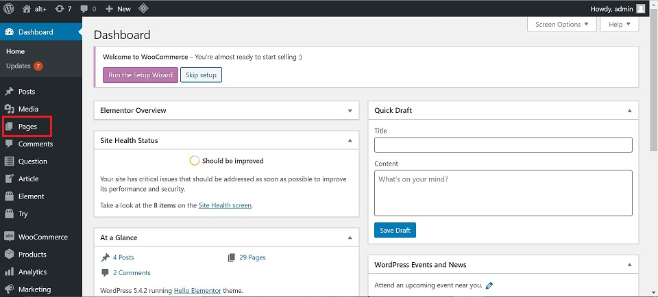

4.  Select -> **Topic** -> this will open the Add New Topic page.

    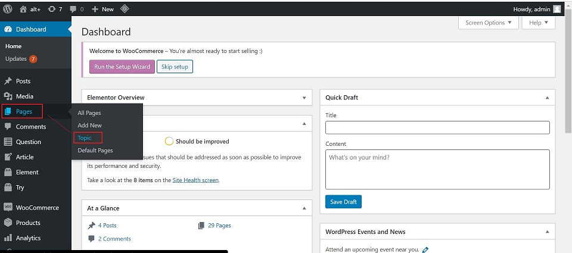

5.  Add New Topics:

    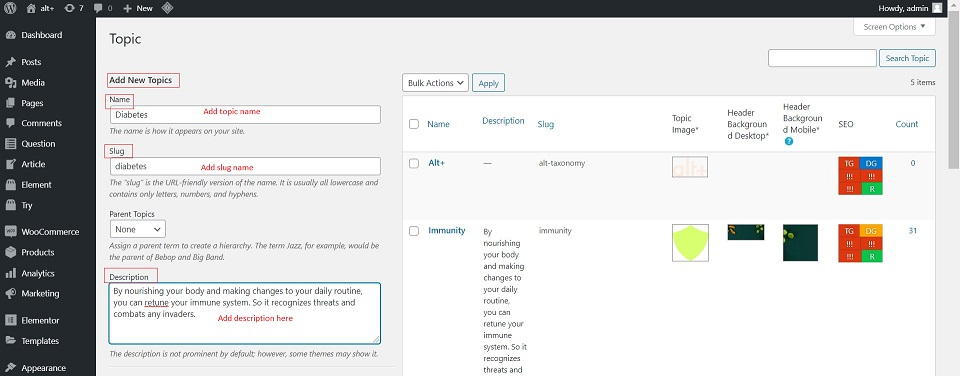

    -   **Name** - It should be the name which should be visible on the website.

        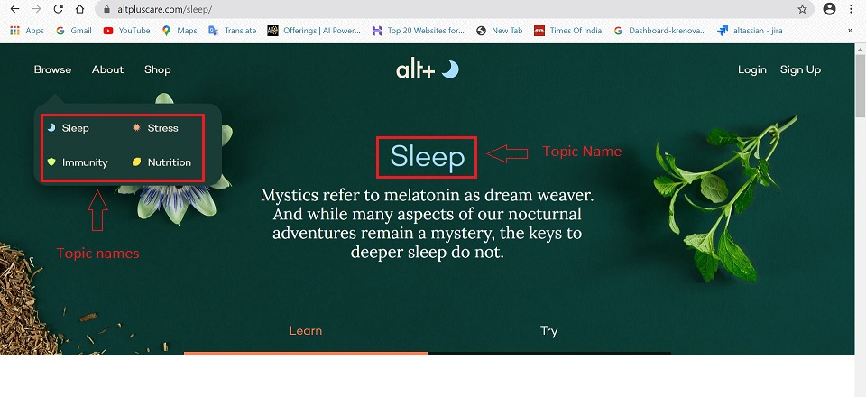

    -   **Slug** - This is the URL friendly name. Keep it same as Name.

        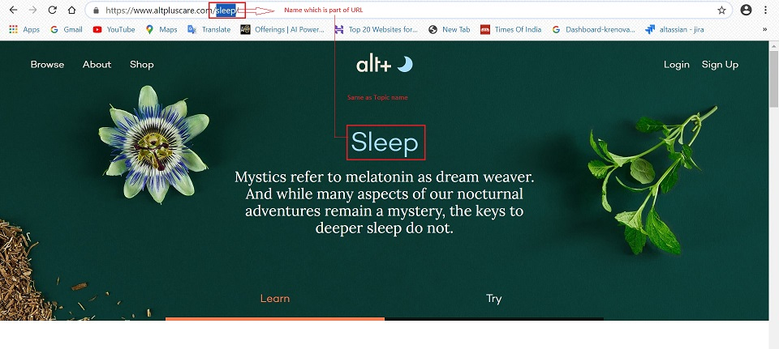

    -   **Description** - This is the topic description which shows under the topic name on the website. It should be copied from the right side panel.

        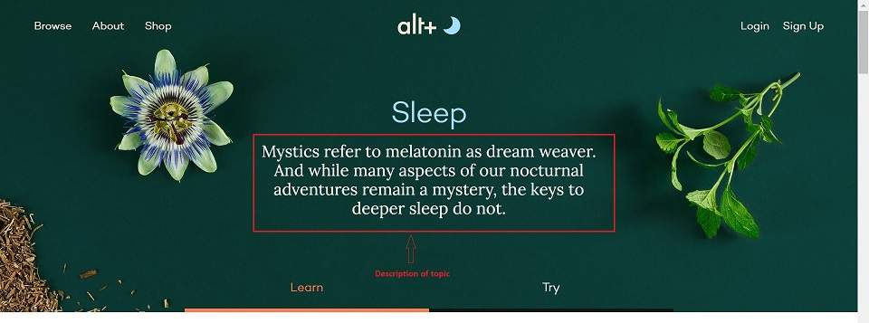

6.  Topics:

    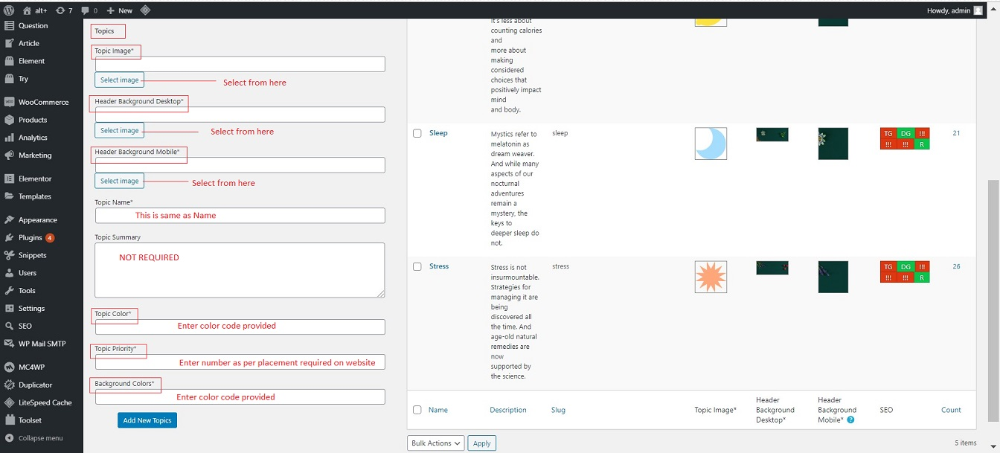

    -   **Topic image** - This is a small icon which preceeds the topic name. Click on 'Select Image'.

        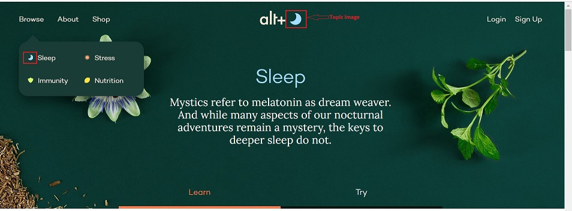

    -   **Header Background Desktop** - This is the topic background image for desktop website. Click on 'Select Image'.

        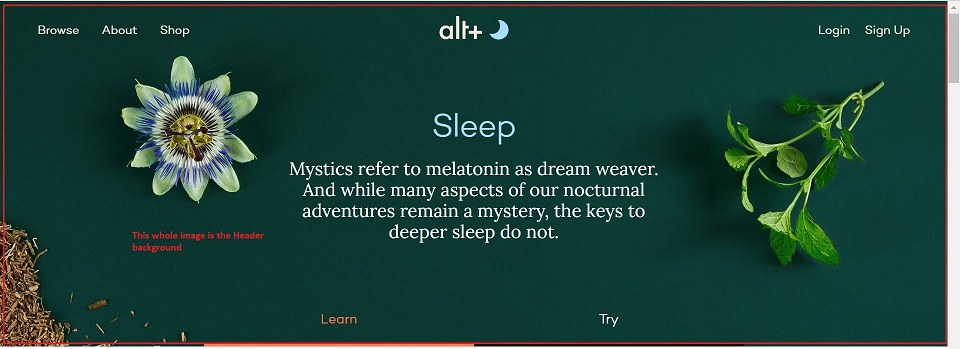

    -   **Header Background Mobile** - This is the topic background image for mobile website. Click on 'Select Image'.
    -   **Topic Name** - This is same as **Name**
    -   **Topic Summary** - This field is not required.
    -   **Topic Color** - This is the color assigned to the Topic as it will show on the website. The color is designated by "#' and a number (eg. #a5ddff). The color code to be entered will be provided to you.

        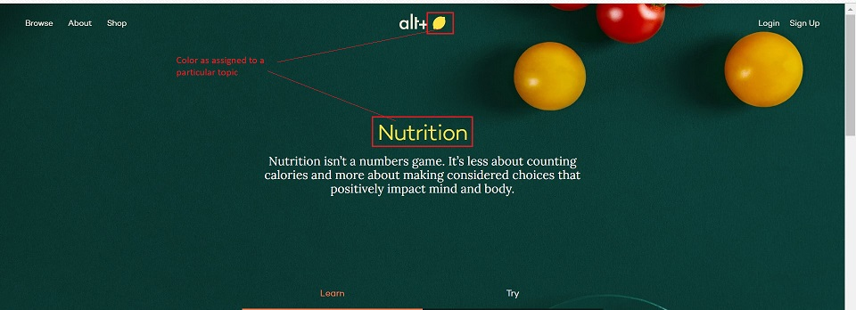

    -   **Topic Priority** - This defines the placement of the topic. Only numbers need to be entered. When a new topic is added and given a priority, the priority needs to be adjusted for other topics as well.

        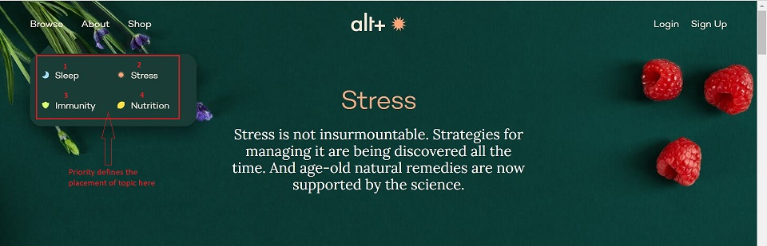

    -   **Background Colors** -  This is the backgound color assigned to the topic Question/Answer placards. The color is designated by "#' and a number (eg. #ebf9ff). The color code to be entered will be provided to you.

        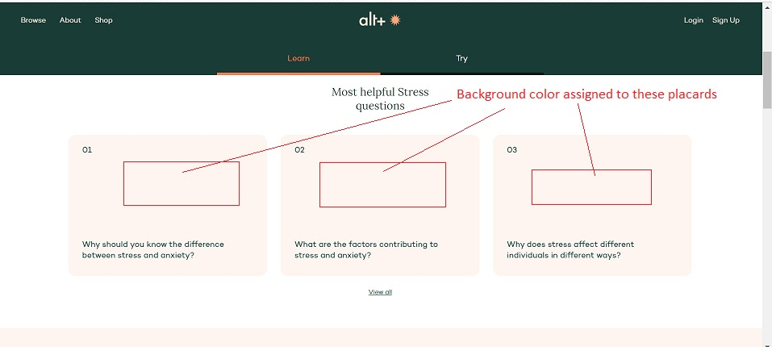

7.  Click on **Add New Topics** at the bottom of page to save the changes.

    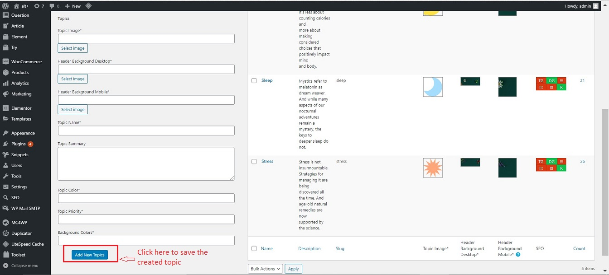

**Note** : The topic page created here is by default the [Learn Page](Pages/Learn-Page.md) for the topic.
    
