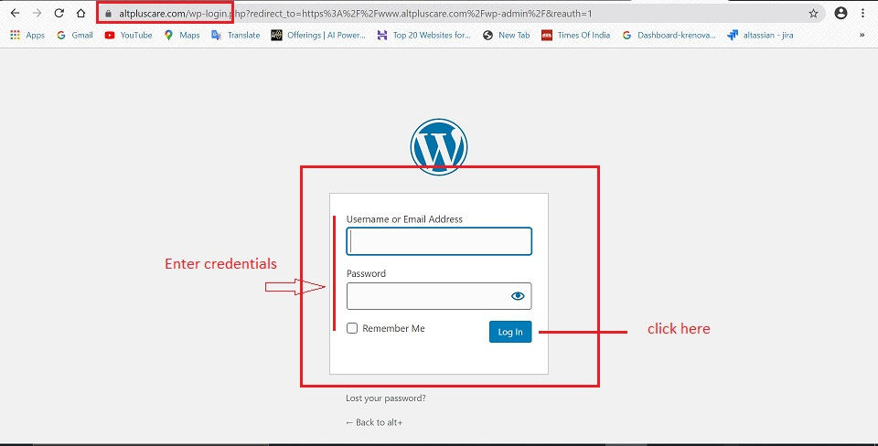

#   **Alt+ Admin Guide**

Welcome to the world of alternative wellness. The online pages provide an easy-to-use interface with a powerful set of tools allowing you to interact with your audience in real-time over the web, anytime and anywhere.

As an administrator, you will see that updating and editing existing knowledge online is a snap.

This Admin Manual will serve as a guide to the adminsitrators at Alt+, in their day-to-day performance of administrative and management functions.

It contains tips and methods for establishing, organizing, writing, and editing each component of the website and should be useful to anyone associated with these activities.

## **Introduction**

The Admin manual has been created for the Admin team of Alt+. The purpose of this guide is to:

-   increase productivity by reducing time spent in asking questions and waiting for a response.
-   provide valuable assistance in training new employees.
-   provide instructions on how to create different classes and manage the same.

## **Login - Admin Panel**

-   Go to altpluscare.com/wp-admin
-   Enter the User id and password
-   Click on Log In

##  **Login Credentials**

-   The username and password is available with the Admin team.
-   The login credentials are case sensitive and have to be entered in the given format.

##  **List of admin tasks**

In this manual we will cover step-by-step instructions for the below tasks:

1.  [Topic](Topic.md)
2.  Pages

    -   [Learn Page](Pages/Learn-Page.md)
    -   [Try Page](Pages/Try-Page.md)

3.  [Questions](Questions.md)
4.  [Articles](Articles.md)
5.  [Elements](Elements.md)
6.  [SEO Management](SEO-Management.md)

